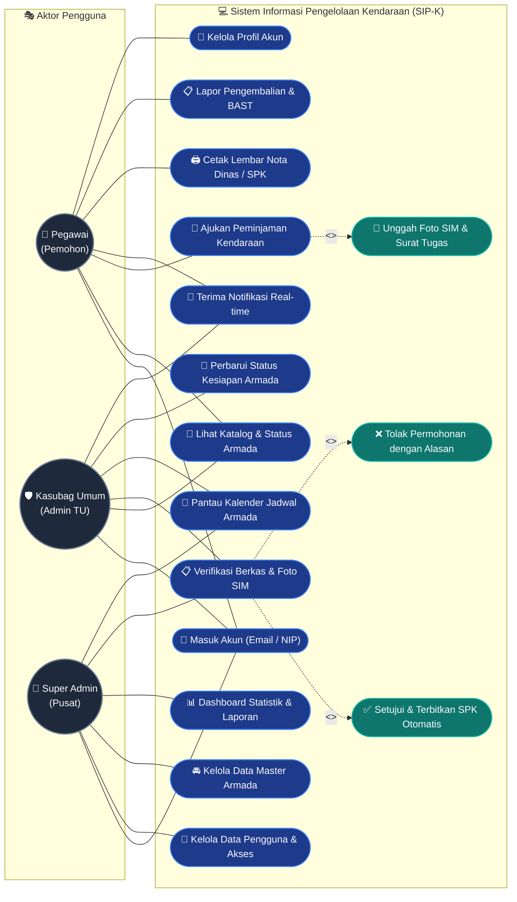
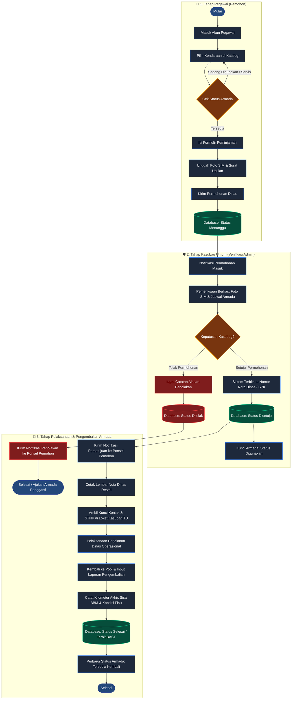
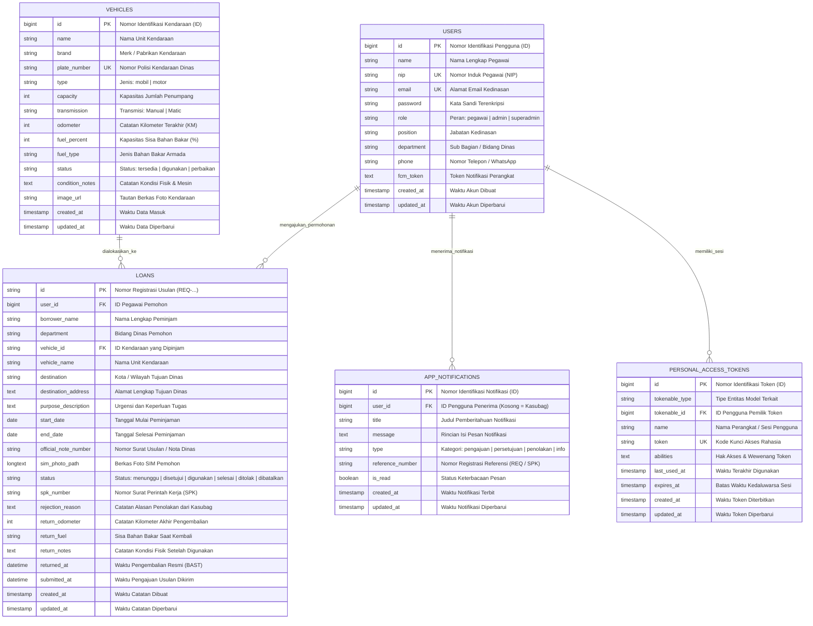

<p align="center">
  
</p>

<h1 align="center">🚗 SIP-K JATIM</h1>
<h3 align="center">Sistem Informasi Pengelolaan Kendaraan Dinas Operasional</h3>
<p align="center"><strong>Pemerintah Provinsi Jawa Timur — Dinas Sosial</strong></p>

<p align="center">
  
  
  
  
  
  
</p>

<p align="center">
  <a href="#-tentang-proyek">Tentang</a> •
  <a href="#-fitur-utama">Fitur Utama</a> •
  <a href="#%EF%B8%8F-arsitektur-teknologi">Arsitektur</a> •
  <a href="#-diagram-kasus-penggunaan-use-case-diagram">Use Case</a> •
  <a href="#-diagram-alur-sistem-flowchart-operasional">Flowchart</a> •
  <a href="#%EF%B8%8F-struktur-basis-data-erd">ERD</a> •
  <a href="#-panduan-instalasi--menjalankan">Instalasi</a> •
  <a href="#-support-by-">Support By</a>
</p>

---

## 📌 Tentang Proyek

**SIP-K Jatim** (*Sistem Informasi Pengelolaan Kendaraan Dinas*) adalah platform modern terpadu berbasis **Aplikasi Mobile (Flutter)** dan **RESTful API (Laravel)** yang dikembangkan untuk memfasilitasi tata kelola peminjaman dan operasional kendaraan dinas di lingkungan **Dinas Sosial Provinsi Jawa Timur**.

Sistem ini mentransformasi alur birokrasi peminjaman manual menjadi serba digital, transparan, akuntabel, dan *real-time*. Dilengkapi verifikasi berjenjang:
1. **Pengajuan Kedinasan Mandiri** oleh pegawai beserta unggah dokumen foto SIM.
2. **Verifikasi & Persetujuan** oleh Kasubag Umum / Tata Usaha dengan penerbitan nomor Surat Perintah Kerja (SPK) otomatis.
3. **Pencetakan Lembar Nota Dinas** resmi kedinasan.
4. **Pelaporan Berita Acara Serah Terima (BAST)** saat armada kembali ke pool.

---

## ✨ Fitur Utama

### 👤 1. Portal Pegawai (Pemohon)
* 🚘 **Katalog & Ketersediaan Armada**: Pantau unit mobil dan motor dinas lengkap dengan foto, kapasitas kursi, transmisi, sisa BBM, dan odometer (KM).
* 📝 **Formulir Pengajuan Digital**: Pengisian kota tujuan, tanggal dinas, urgensi tugas, dan unggah foto SIM (dengan fitur pratinjau & perbesar).
* 🔔 **Pusat Notifikasi Real-Time**: Pembaruan status permohonan (*Disetujui*, *Ditolak*, atau *Menunggu*) langsung ke perangkat.
* 📜 **Arsip Riwayat & Cetak Nota Dinas**: Cetak lembar bukti peminjaman resmi dan lapor mandiri kondisi armada saat pengembalian.

### 🛡️ 2. Portal Kasubag Tata Usaha & Super Administrator
* 📋 **Verifikasi Berkas & Kelayakan**: Verifikasi data pemohon, keabsahan foto SIM, dan deteksi otomatis jadwal armada agar tidak terjadi benturan.
* ✅ **Penerbitan SPK Otomatis**: Generate nomor Surat Perintah Kerja (SPK) kedinasan secara otomatis.
* ❌ **Penolakan Transparan**: Input catatan alasan penolakan yang otomatis terkirim ke notifikasi pemohon.
* 📅 **Kalender Jadwal Operasional**: Tampilan visual interaktif jadwal keberangkatan seluruh unit armada dinas.
* 📊 **Dashboard Analitik**: Grafik statistik frekuensi armada terpakai, rata-rata konsumsi BBM, dan rekapitulasi dinas bulanan.
* 👥 **Manajemen Master Data**: Penambahan armada baru, pembaruan status servis/pemeliharaan, serta manajemen pengguna.

---

## 🏗️ Arsitektur Teknologi

```text
┌─────────────────────────────────┐           ┌─────────────────────────────────┐
│     APLIKASI KLIEN (FLUTTER)    │           │      SERVER BACKEND (LARAVEL)   │
│  - Aplikasi Android (APK)       │   HTTP/S  │  - RESTful API Controller       │
│  - Portal Web (Dashboard Admin) │ <───────> │  - Autentikasi Token Sanctum    │
│  - Aplikasi Desktop Windows     │    JSON   │  - Firebase Cloud Messaging     │
└─────────────────────────────────┘           └─────────────────────────────────┘
                                                               │
                                                               ▼
                                              ┌─────────────────────────────────┐
                                              │      DATABASE (MYSQL 8.4)       │
                                              │  - Master Data Pengguna         │
                                              │  - Master Data Armada Kendaraan │
                                              │  - Riwayat Peminjaman & SPK     │
                                              │  - Log Notifikasi & Aktivitas   │
                                              └─────────────────────────────────┘
```

---

## 👥 Diagram Kasus Penggunaan (Use Case Diagram)

Diagram berikut memodelkan interaksi antara tiga aktor utama (**Pegawai / Pemohon**, **Kasubag Umum / Admin TU**, dan **Super Administrator**) dengan fungsionalitas sistem SIP-K:



### 📊 Matriks Hak Akses Pengguna

| No | Modul & Kasus Penggunaan (*Use Case*) | Pegawai (Pemohon) | Kasubag Umum (Admin TU) | Super Administrator |
|:---:|---|:---:|:---:|:---:|
| 1 | **Masuk Sistem (Email / NIP)** | ✅ | ✅ | ✅ |
| 2 | **Lihat Katalog & Status Armada** | ✅ | ✅ | ✅ |
| 3 | **Pengajuan Peminjaman & Unggah SIM** | ✅ | ❌ | ❌ |
| 4 | **Pusat Notifikasi Status Pengajuan** | ✅ | ✅ | ✅ |
| 5 | **Cetak Nota Dinas / SPK Resmi** | ✅ | ✅ | ✅ |
| 6 | **Pelaporan Pengembalian Armada & BAST** | ✅ | ✅ | ✅ |
| 7 | **Verifikasi Usulan & Persetujuan/Penolakan SPK** | ❌ | ✅ | ✅ |
| 8 | **Pemantauan Kalender Jadwal Armada** | ❌ | ✅ | ✅ |
| 9 | **Ubah Status Armada (Tersedia / Servis / Digunakan)** | ❌ | ✅ | ✅ |
| 10 | **Manajemen Data Akun Pengguna** | ❌ | ❌ | ✅ |
| 11 | **Manajemen Master Data Armada (Tambah/Ubah/Hapus)** | ❌ | ❌ | ✅ |
| 12 | **Dashboard Statistik & Ekspor Laporan Bulanan** | ❌ | ❌ | ✅ |

---

## 🔄 Diagram Alur Sistem (Flowchart Operasional)

Alur lengkap siklus operasional peminjaman armada dari pengajuan, verifikasi, hingga penerbitan BAST pengembalian:



---

## 🗄️ Struktur Basis Data (ERD)

Skema relasi antar entitas basis data **`sip-k`** pada MySQL:



### 🔗 Integritas Data & Relasi
1. **`users` ➔ `loans` (Satu-ke-Banyak)**: Satu akun pegawai dapat memiliki banyak riwayat pengajuan permohonan dinas (`loans.user_id` merujuk ke `users.id`).
2. **`vehicles` ➔ `loans` (Satu-ke-Banyak)**: Satu armada kendaraan dapat dijadwalkan dalam banyak agenda dinas (`loans.vehicle_id` merujuk ke `vehicles.id`).
3. **`users` ➔ `app_notifications` (Satu-ke-Banyak)**: Notifikasi status persetujuan, penolakan, atau pesan personal terikat langsung ke akun pemohon (`app_notifications.user_id`). Notifikasi dengan `user_id = NULL` berlaku sebagai notifikasi umum verifikasi untuk Kasubag/Admin.
4. **`users` ➔ `personal_access_tokens` (Satu-ke-Banyak)**: Mengelola sesi login multi-perangkat melalui token Sanctum untuk keamanan API.

---

## 📁 Struktur Direktori Proyek

```bash
SIP-K/
├── android/                 # Konfigurasi native sistem Android & Gradle
├── assets/                  # Logo SIP-K, foto armada dinas, dan ikon
├── backend/                 # Kode sumber REST API Laravel 11
│   ├── app/Http/Controllers # Controller Otentikasi, Pinjaman, Armada, Notifikasi, Pengguna
│   ├── app/Models/          # Model Eloquent (User, Loan, Vehicle, AppNotification)
│   ├── database/migrations/ # Skema struktur tabel database MySQL
│   ├── database/seeders/    # Data awal armada dan akun default
│   └── routes/api.php       # Endpoint REST API
├── lib/                     # Kode sumber aplikasi Flutter
│   ├── models/              # Model data Dart (Kendaraan, Pinjaman, Notifikasi, Pengguna)
│   ├── screens/             # Tampilan UI (Dashboard, Formulir, Admin, Notifikasi)
│   ├── services/            # Layanan API, Firebase FCM, dan Manajemen Tema
│   └── widgets/             # Komponen UI khusus (Kartu armada, dialog perbesar SIM)
├── sip-k-database.sql       # Berkas cadangan database MySQL siap pakai
└── pubspec.yaml             # Manajemen paket dan dependensi Flutter
```

---

## 🚀 Panduan Instalasi & Menjalankan

### 1. Menjalankan Backend Laravel
Pastikan PHP (>= 8.2) dan MySQL sudah terpasang dan berjalan (Laragon / XAMPP):
```bash
cd backend
composer install
cp .env.example .env
php artisan key:generate

# Konfigurasi database pada berkas .env:
# DB_DATABASE=sip-k
# DB_USERNAME=root
# DB_PASSWORD=

php artisan migrate --seed
php artisan serve
```

### 2. Menjalankan Aplikasi Flutter
```bash
# Unduh paket dan dependensi
flutter pub get

# Menjalankan di browser Chrome / Web
flutter run -d chrome

# Menjalankan di perangkat fisik Android / Emulator
flutter run
```

### 3. Konfigurasi Endpoint API
Untuk menghubungkan aplikasi ke server, perbarui URL pada `lib/services/api_config.dart`:
```dart
class ApiConfig {
  static String get baseUrl => 'http://<IP_KOMPUTER_ATAU_DOMAIN>/sip-k-backend/public/api';
}
```

---

## 🔑 Akun Uji Coba Bawaan Sistem

| Peran / Hak Akses | Nama Pengguna | Akun Masuk (Email / NIP) | Kata Sandi | Wewenang Utama |
|---|---|---|---|---|
| **Pegawai (Pemohon)** | Alamsyah | `199503152020121002` | `password` | Pengajuan dinas, pantau SPK, cetak Nota Dinas |
| **Kasubag Umum (Admin TU)** | Ahmad Dewantara, S.STP | `admin@dinsos.jatimprov.go.id` | `admin123` | Verifikasi berkas, setujui / tolak usulan SPK |
| **Super Administrator** | Super Admin SIP-K | `superadmin@dinsos.jatimprov.go.id` | `superadmin123` | Hak akses penuh, kelola armada & pengguna |

---

## 📄 Lisensi
Hak Cipta © 2026 **Pemerintah Provinsi Jawa Timur — Dinas Sosial**.  
Dikembangkan untuk mendukung digitalisasi dan transparansi tata kelola aset daerah.

---

## Support by :  
**DRD**  
**Telkom University Surabaya**  
*18 Agustus 2026 s.d. 15 Januari 2027*  

---
<p align="center">
  <sub>Sistem Informasi Pengelolaan Kendaraan (SIP-K) • Dinas Sosial Provinsi Jawa Timur</sub>
</p>
