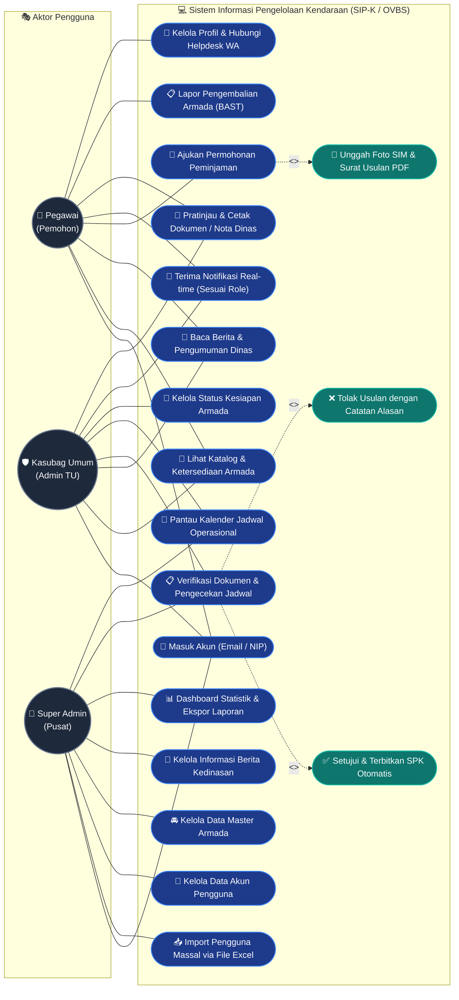
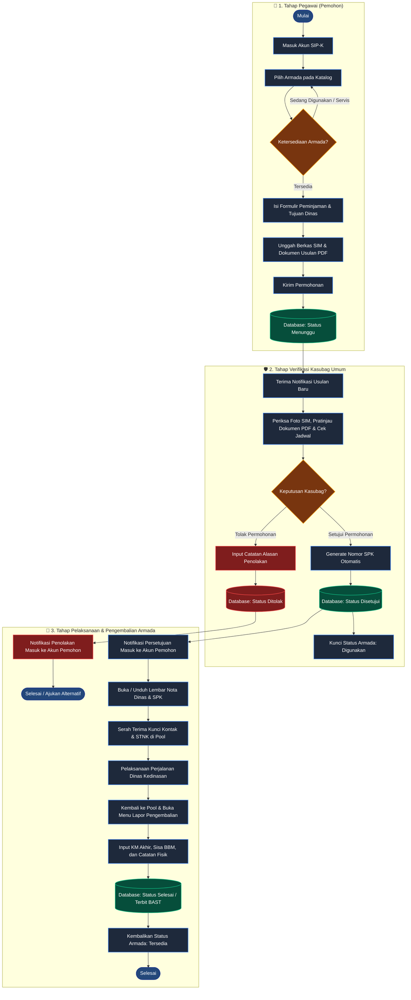
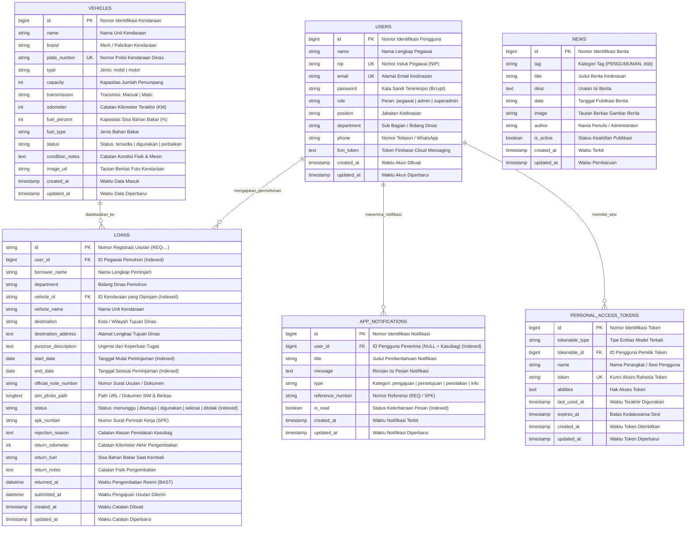

<p align="center">
  
</p>

<h1 align="center">🚗 SIP-K JATIM / OVBS</h1>
<h3 align="center">Sistem Informasi Pengelolaan Kendaraan Dinas Operasional<br/><i>(Online Vehicle Booking System)</i></h3>
<p align="center"><strong>Pemerintah Provinsi Jawa Timur — Dinas Sosial</strong></p>

<p align="center">
  
  
  
  
  
  
  
</p>

<p align="center">
  <a href="#-tentang-proyek">Tentang</a> •
  <a href="#-fitur-utama">Fitur Utama</a> •
  <a href="#%EF%B8%8F-arsitektur--optimasi-performa-tinggi">Arsitektur & Kinerja</a> •
  <a href="#-diagram-kasus-penggunaan-use-case-diagram">Use Case</a> •
  <a href="#-diagram-alur-sistem-flowchart-operasional">Flowchart</a> •
  <a href="#%EF%B8%8F-struktur-basis-data-erd">ERD</a> •
  <a href="#-panduan-instalasi--deployment">Instalasi & Deployment</a> •
  <a href="#-akun-uji-coba-bawaan-sistem">Akun Default</a> •
  <a href="#-support-by-">Support By</a>
</p>

---

## 📌 Tentang Proyek

**SIP-K Jatim** (*Sistem Informasi Pengelolaan Kendaraan Dinas Operasional*), juga dikenal sebagai **OVBS** (*Online Vehicle Booking System*), adalah platform modern terpadu multi-platform (**Aplikasi Mobile Flutter**, **Web Portal**, dan **Windows Desktop**) yang didukung oleh **RESTful API Laravel 11** berkinerja tinggi. Sistem ini dirancang secara khusus untuk memfasilitasi tata kelola peminjaman, perizinan, dan pemeliharaan kendaraan dinas di lingkungan **Dinas Sosial Provinsi Jawa Timur**.

Sistem ini mentransformasi birokrasi manual berbasis formulir fisik menjadi alur kerja serba digital, transparan, akuntabel, dan *real-time*:
1. **Pengajuan Kedinasan Mandiri**: Pegawai mengajukan unit kendaraan secara langsung, memilih jadwal, melampirkan berkas foto SIM, serta mengunggah surat usulan dinas (PDF/Gambar).
2. **Verifikasi & Persetujuan Kasubag Umum / TU**: Pemeriksaan keabsahan dokumen, pengecekan jadwal bebas-benturan secara otomatis, penerbitan nomor Surat Perintah Kerja (SPK) otomatis, atau penolakan dengan catatan resmi.
3. **Dual Pratinjau & Pengunduhan Dokumen**: Dukungan pratinjau langsung berkas PDF asli yang diunggah pemohon serta opsi format lembar Nota Dinas standar Pemprov Jatim, dilengkapi penyimpanan otomatis ke folder *Download/OVBS*.
4. **Pelaporan Berita Acara Serah Terima (BAST)**: Pencatatan kilometer akhir (odometer), level sisa BBM, dan catatan fisik saat kendaraan kembali ke pool.

---

## ✨ Fitur Utama

### 👤 1. Portal Pegawai (Pemohon)
* 🚘 **Katalog & Ketersediaan Armada Real-time**: Menampilkan unit mobil dan motor dinas lengkap dengan foto resolusi tinggi, jenis transmisi, kapasitas penumpang, sisa bahan bakar, dan status kesiapan.
* 📝 **Formulir Pengajuan Terpadu**: Input tujuan dinas, alamat, tanggal pinjam, urgensi tugas, unggah foto SIM, serta berkas surat tugas / nota dinas (PDF / Gambar).
* 📄 **In-App Dual PDF Viewer**:
  * Menampilkan dokumen asli yang diunggah oleh pemohon secara instan.
  * Opsi berganti ke format Lembar Nota Dinas resmi kedinasan.
  * Fitur perbesar (*zoom*), navigasi halaman, pencarian, dan unduh otomatis ke penyimpanan perangkat (`Download/OVBS/`).
* 🔔 **Notifikasi Real-time Terpersonalisasi**: Pegawai hanya menerima notifikasi khusus yang berkaitan dengan pengajuannya (*Diajukan*, *Disetujui*, *Ditolak*, atau *Pemberitahuan Umum*).
* 📰 **Berita & Pengumuman Kedinasan**: Menampilkan informasi, kegiatan, dan surat edaran resmi dari pimpinan Dinas Sosial Jatim.
* 📜 **Riwayat Pengajuan & BAST Mandiri**: Pemantauan status permohonan dinas serta input mandiri laporan pengembalian unit saat armada kembali.

### 🛡️ 2. Portal Kasubag Tata Usaha & Super Administrator
* 📋 **Verifikasi Berkas & Pengecekan Tabrakan Jadwal**: Pemeriksaan foto SIM dan pratinjau dokumen usulan pemohon dengan sistem deteksi benturan jadwal antar peminjam.
* ✅ **Penerbitan SPK Otomatis**: Menghasilkan nomor Surat Perintah Kerja (SPK) unik kedinasan saat permohonan disetujui.
* ❌ **Penolakan Transparan**: Mengirimkan catatan alasan penolakan secara terstruktur yang langsung diterima pemohon.
* 📅 **Kalender Jadwal Operasional Seluruh Armada**: Visualisasi jadwal agenda perjalanan seluruh armada dinas secara interaktif harian dan bulanan.
* 📥 **Import Pengguna Massal via Excel (`.xlsx`)**:
  * Mengunggah daftar pegawai dan admin sekaligus menggunakan berkas template Excel.
  * Deteksi peran otomatis (*Pegawai*, *Admin TU / Kasubag*, *Super Administrator*).
  * Sanitasi nomor WhatsApp/telepon dan pembuatan kata sandi awal secara otomatis.
* 📊 **Dashboard Analitik & Statistik**: Statistik unit paling sering digunakan, rata-rata konsumsi BBM, grafik tren dinas bulanan, dan ekspor data laporan.
* 🔧 **Manajemen Master Data Kendaraan**: Tambah, ubah data unit, kelola status perbaikan/servis rutin di bengkel, dan kelola dokumen unit.
* 🔔 **Segregasi Notifikasi Verifikator**: Administrator menerima notifikasi khusus mengenai usulan baru yang masuk serta pengembalian armada oleh pemohon.
* 💬 **Helpdesk WhatsApp Terintegrasi**: Akses cepat satu klik ke WhatsApp Admin Helpdesk untuk bantuan teknis dan reset kata sandi.

---

## ⚡ Arsitektur & Optimasi Performa Tinggi

Sistem dirancang tangguh (*high-concurrency ready*) untuk melayani ratusan pegawai dan admin secara bersamaan tanpa lonjakan beban (*resource spike*):

```text
┌────────────────────────────────────────────────────────┐
│               APLIKASI KLIEN (FLUTTER)                 │
│  - Android APK (Mobile)                                │
│  - Web Portal (Chrome / Edge / Firefox)                │
│  - Windows Desktop Native                              │
│                                                        │
│  [Fitur Kinerja]:                                      │
│  * Persistent Connection Pool (HTTP Keep-Alive)        │
│  * In-Memory TTL Cache (Kendaraan, User, Profil)       │
│  * Lifecycle-Aware Polling (Jeda saat background)      │
│  * In-App PDF Streamer & Auto-Download ke Storage      │
└───────────────────────────┬────────────────────────────┘
                            │
                            │ HTTPS / REST API JSON
                            ▼
┌────────────────────────────────────────────────────────┐
│            AZURE CLOUD VM (UBUNTU / NGINX)             │
│  IP Server: 20.244.48.18 | PHP 8.2+ FPM                │
│                                                        │
│  [Laravel 11 REST API Backend]:                        │
│  * Laravel Sanctum Token Authentication                │
│  * Cache::remember Layer untuk Katalog Armada          │
│  * Base64 to Storage Pipeline (public/storage/)        │
│  * Push Notifications via Firebase Cloud Messaging     │
└───────────────────────────┬────────────────────────────┘
                            │
                            ▼
┌────────────────────────────────────────────────────────┐
│                 DATABASE (MYSQL 8.4)                   │
│  * Composite Indexes pada Kolom Query Kritis           │
│    (user_id + status, vehicle_id + start/end_date)     │
│  * Efficient Foreign Keys & Relational Integrity       │
└────────────────────────────────────────────────────────┘
```

### 🚀 Keunggulan Optimasi Kinerja
1. **Persistent HTTP Client (Keep-Alive Pooling)**: Menggunakan satu instance `http.Client` berumur panjang pada aplikasi Flutter untuk menghilangkan jeda *TCP 3-way handshake* dan *TLS negotiation* berulang, mencegah *socket exhaustion* saat banyak pengguna aktif.
2. **Multi-tier Caching**:
   * *Client-side*: Caching data armada dan pengguna di memori dengan durasi kadaluwarsa (TTL 60 detik) dan pembatalan otomatis (*auto-invalidation*) seketika setelah operasi buat/ubah/hapus usulan.
   * *Server-side*: Query katalog kendaraan dilindungi oleh `Cache::remember` dengan pembersihan otomatis via `Cache::forget` saat terjadi pembaruan armada.
3. **Lifecycle-Aware Polling**: Pemantauan data berkala secara cerdas dijeda ketika aplikasi diminimalkan ke latar belakang (*paused/inactive*) dan langsung disegarkan saat aplikasi kembali aktif (*resumed*), menghemat kuota dan baterai pengguna.
4. **Base64 to Storage Streaming**: Lampiran PDF dan gambar berukuran besar tidak lagi disimpan langsung ke kolom database melainkan didecode dan disimpan ke `public/storage/loan_documents/`, menjaga database tetap ramping dan mencegah kegagalan paket data MySQL.
5. **Database Indexing**: Indeks gabungan (*composite index*) pada tabel `loans`, `vehicles`, dan `app_notifications` untuk mempercepat pemfilteran riwayat dan pengecekan tabrakan jadwal hingga < 10ms.

---

## 👥 Diagram Kasus Penggunaan (Use Case Diagram)



### 📊 Matriks Hak Akses Pengguna

| No | Modul & Fungsionalitas (*Feature*) | Pegawai (Pemohon) | Kasubag Umum (Admin TU) | Super Administrator |
|:---:|---|:---:|:---:|:---:|
| 1 | **Autentikasi Akun (Email / NIP)** | ✅ | ✅ | ✅ |
| 2 | **Katalog Armada & Ketersediaan** | ✅ | ✅ | ✅ |
| 3 | **Baca Berita & Pengumuman Dinas** | ✅ | ✅ | ✅ |
| 4 | **Pengajuan Peminjaman & Unggah SIM/PDF** | ✅ | ❌ | ❌ |
| 5 | **Notifikasi Real-time Terpersonalisasi** | ✅ *(Permohonan Sendiri)* | ✅ *(Semua Usulan Masuk)* | ✅ *(Semua Aktivitas)* |
| 6 | **Pratinjau PDF Asli & Cetak Nota Dinas** | ✅ | ✅ | ✅ |
| 7 | **Pelaporan Pengembalian Armada & BAST** | ✅ | ✅ | ✅ |
| 8 | **Verifikasi Usulan & Persetujuan/Penolakan SPK** | ❌ | ✅ | ✅ |
| 9 | **Kalender Jadwal Operasional Seluruh Armada** | ❌ | ✅ | ✅ |
| 10 | **Pembaruan Status Kendaraan (Tersedia/Servis)** | ❌ | ✅ | ✅ |
| 11 | **Import Pengguna Massal via File Excel (.xlsx)** | ❌ | ❌ | ✅ |
| 12 | **Manajemen Data Pengguna (CRUD Akun)** | ❌ | ❌ | ✅ |
| 13 | **Manajemen Master Data Armada (CRUD Kendaraan)** | ❌ | ❌ | ✅ |
| 14 | **Manajemen Berita & Informasi Kedinasan** | ❌ | ❌ | ✅ |
| 15 | **Dashboard Analitik & Ekspor Laporan Bulanan** | ❌ | ❌ | ✅ |

---

## 🔄 Diagram Alur Sistem (Flowchart Operasional)



---

## 🗄️ Struktur Basis Data (ERD)

Skema relasi antar entitas basis data **`sip-k`** pada MySQL:



---

## 📁 Struktur Direktori Proyek

```bash
SIP-K/
├── android/                 # Konfigurasi native Android (Gradle, Manifest, Permissions)
├── assets/                  # Logo SIP-K, gambar kendaraan dinas, & aset ikon
├── backend/                 # Backend RESTful API berbasis Laravel 11
│   ├── app/Http/Controllers # Controller: Auth, Loan, Vehicle, Notification, User, News
│   ├── app/Models/          # Model Eloquent: User, Loan, Vehicle, AppNotification, News
│   ├── database/migrations/ # Skema migrasi tabel & indeks performa MySQL
│   ├── database/seeders/    # Seeder data pengguna, kendaraan, & berita awal
│   ├── public/storage/      # Direktori publik penyimpanan berkas SIM & PDF
│   └── routes/api.php       # Definisi endpoint REST API
├── lib/                     # Aplikasi Flutter Multiplatform
│   ├── models/              # Model data Dart (Kendaraan, Pinjaman, Notifikasi, Pengguna, Berita)
│   ├── screens/             # Layanan layar tampilan UI:
│   │   ├── home_screen.dart          # Dashboard utama, kalender, berita, & navigasi
│   │   ├── loan_form_screen.dart     # Formulir pengajuan permohonan dinas
│   │   ├── loan_history_screen.dart  # Riwayat peminjaman & pelaporan BAST
│   │   ├── admin_screen.dart         # Panel verifikasi usulan & manajemen armada
│   │   ├── user_management_screen.dart # Manajemen pengguna & import file Excel
│   │   ├── notification_screen.dart  # Pusat notifikasi terpersonalisasi
│   │   └── profile_screen.dart       # Profil akun & helpdesk WhatsApp
│   ├── services/            # Logika bisnis & integrasi:
│   │   ├── api_service.dart          # Klien HTTP persistent, caching, & pemanggilan API
│   │   ├── api_config.dart           # Konfigurasi endpoint URL & kontak helpdesk
│   │   ├── excel_import_service.dart # Parser berkas Excel .xlsx dengan deteksi peran
│   │   ├── firebase_service.dart     # Pengelola notifikasi push Firebase FCM
│   │   └── theme_service.dart        # Pengelola mode tema tampilan
│   └── widgets/             # Komponen UI interaktif (PDF Viewer Dialog, Zoom SIM, dsb)
├── sip-k-database.sql       # Cadangan skema basis data MySQL siap pakai
└── pubspec.yaml             # Konfigurasi dependensi dan pustaka Flutter
```

---

## 🚀 Panduan Instalasi & Deployment

### A. Pengujian & Pengembangan Lokal (Local Development)

#### 1. Menjalankan Backend Laravel
Pastikan PHP (>= 8.2) dan MySQL telah terpasang (Laragon / XAMPP):
```bash
cd backend
composer install
cp .env.example .env
php artisan key:generate

# Konfigurasi berkas .env untuk database:
# DB_DATABASE=sip-k
# DB_USERNAME=root
# DB_PASSWORD=

# Jalankan migrasi dan penghubung storage:
php artisan storage:link
php artisan migrate --seed
php artisan serve --host=0.0.0.0 --port=8000
```

#### 2. Menjalankan Aplikasi Flutter
```bash
# Unduh seluruh paket dependensi
flutter pub get

# Jalankan di Google Chrome (Web)
flutter run -d chrome

# Jalankan di Perangkat Android Fisik / Emulator
flutter run
```

---

### B. Deployment Server Produksi (Azure Cloud Virtual Machine)

Sistem telah berjalan pada server **Azure Cloud Virtual Machine (Ubuntu 22.04 LTS)** dengan alamat IP: `20.244.48.18`.

Langkah-langkah pembaruan (*deploy update*) di server produksi:

```bash
# 1. Masuk ke server melalui SSH
ssh dewa@20.244.48.18

# 2. Masuk ke direktori backend proyek
cd /var/www/Sip-k/backend

# 3. Ambil pembaruan kode terbaru dari GitHub
git pull origin main

# 4. Pasang/perbarui pustaka dependensi PHP
composer install --no-dev --optimize-autoloader

# 5. Jalankan migrasi basis data (termasuk indeks performa baru)
php artisan migrate --force

# 6. Pastikan symbolic link storage sudah aktif
php artisan storage:link

# 7. Bersihkan dan optimalkan cache produksi
php artisan config:cache
php artisan route:cache
php artisan view:cache

# 8. Pastikan izin akses folder storage dan cache telah sesuai
sudo chown -R www-data:www-data storage bootstrap/cache
sudo chmod -R 775 storage bootstrap/cache
```

> **Catatan:** Jika perintah `php artisan storage:link` menampilkan pesan `ERROR The [public/storage] link already exists`, artinya tautan simbolik sudah terpasang dan berfungsi dengan baik.

---

## 🔑 Akun Uji Coba Bawaan Sistem

| Peran / Hak Akses | Nama Pengguna | Akun Masuk (Email / NIP) | Kata Sandi | Wewenang Utama |
|---|---|---|---|---|
| **Pegawai (Pemohon)** | Alamsyah | `199503152020121002` | `password` | Pengajuan dinas, pantau status, pratinjau & cetak dokumen |
| **Kasubag Umum (Admin TU)** | Ahmad Dewantara, S.STP | `admin@dinsos.jatimprov.go.id` | `admin123` | Verifikasi berkas usulan, setujui / tolak permohonan SPK |
| **Super Administrator** | Super Admin SIP-K | `superadmin@dinsos.jatimprov.go.id` | `superadmin123` | Akses penuh, import Excel massal, manajemen armada & pengguna |

*Layanan Bantuan Akun:* **Helpdesk WhatsApp Admin SIP-K: [0856-0783-2173](https://wa.me/6285607832173)**

---

## 📄 Lisensi
Hak Cipta © 2026 **Pemerintah Provinsi Jawa Timur — Dinas Sosial**.  
Dikembangkan untuk mendukung digitalisasi, transparansi, dan efisiensi tata kelola aset kendaraan dinas operasional daerah.

---

## Support by :  
**DRD**  
**Telkom University Surabaya**  
*18 Agustus 2026 s.d. 15 Januari 2027*  

---
<p align="center">
  <sub>Sistem Informasi Pengelolaan Kendaraan Dinas Operasional (SIP-K / OVBS)<br/>Dinas Sosial Provinsi Jawa Timur</sub>
</p>
