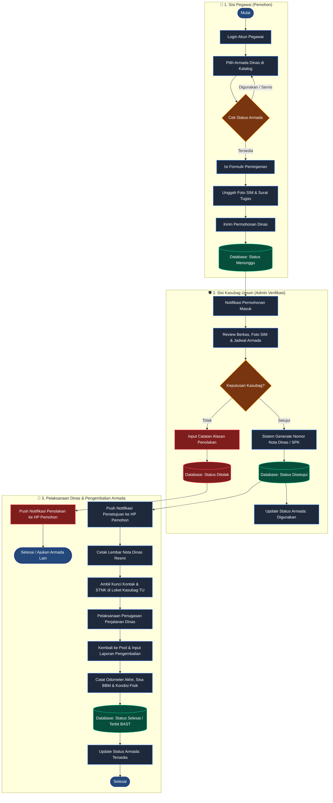
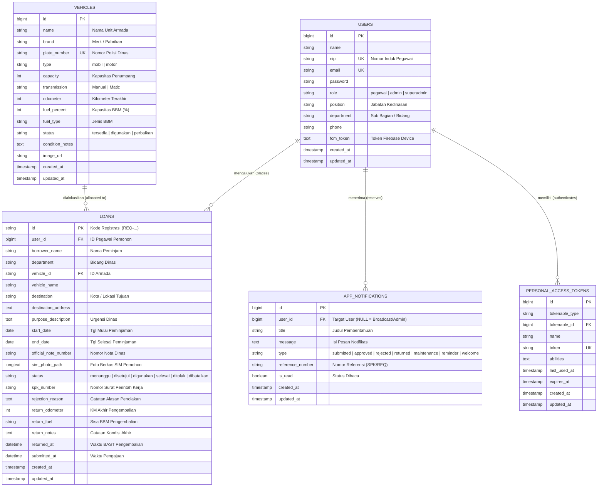

# 🚗 SIP-K JATIM (Sistem Informasi Pengelolaan Kendaraan)
### Dinas Sosial Provinsi Jawa Timur

<p align="center">
  
  
  
  
  
  
</p>

---

## 📌 Tentang Proyek

**SIP-K Jatim** (*Sistem Informasi Pengelolaan Kendaraan Dinas*) adalah aplikasi terintegrasi berbasis **Mobile (Flutter)** dan **RESTful API (Laravel)** yang dirancang khusus untuk memfasilitasi tata kelola peminjaman dan operasional kendaraan dinas operasional di lingkungan **Dinas Sosial Provinsi Jawa Timur**.

Sistem ini mentransformasikan alur birokrasi peminjaman konvensional menjadi digital, transparan, akuntabel, dan *real-time*. Dilengkapi alur verifikasi bertingkat mulai dari pengajuan dinas, pemeriksaan kelayakan administrasi (SIM), penerbitan Nota Dinas / Surat Perintah Kerja (SPK) oleh Kasubag Umum, hingga Berita Acara Serah Terima (BAST) pengembalian armada.

---

## ✨ Fitur Utama

### 👤 1. Sisi Pegawai / Pemohon
- 🚘 **Katalog & Ketersediaan Armada**: Menampilkan unit mobil dan motor dinas lengkap dengan spesifikasi, transmisi, kapasitas, kondisi, indikator BBM, dan odometer terkini.
- 📝 **Formulir Pengajuan Digital**: Input tujuan dinas luar kota/dalam kota, tanggal peminjaman, surat tugas, dan fitur unggah foto SIM (SIM A/C) dengan fitur zoom & preview interaktif.
- 🔔 **Pusat Notifikasi Real-Time**: Pembaruan status permohonan secara otomatis (*Disetujui Kasubag* dengan nomor SPK terbit, *Ditolak*, atau *Menunggu Verifikasi*) tanpa perlu me-refresh aplikasi manual.
- 📜 **Riwayat & Cetak Lembar Nota Dinas**: Akses arsip berkas dinas, pencetakan Nota Dinas resmi, dan pelaporan mandiri saat kendaraan mulai digunakan atau selesai dikembalikan ke pool.

### 🛡️ 2. Sisi Kasubag Tata Usaha & Superadmin
- 📋 **Verifikasi Antrean Permohonan Masuk**: Pemeriksaan dokumen pemohon, kelengkapan SIM, identitas penugasan dinas, dan bentrokan jadwal kendaraan.
- ✅ **Persetujuan & Penerbitan SPK Otomatis**: Generator nomor registrasi Nota Dinas / SPK kedinasan secara otomatis.
- ❌ **Penolakan dengan Berita Acara**: Memberikan alasan penolakan yang langsung terkirim sebagai notifikasi resmi ke HP pemohon.
- 📅 **Kalender Jadwal Operasional Armada**: Visualisasi interaktif kalender penggunaan seluruh armada dinas.
- 📊 **Dashboard Analitik & Monitoring**: Grafik statistik penggunaan armada, armada terlaris, persentase bahan bakar, dan ekspor laporan berkala.
- 👥 **Manajemen Pengguna & Armada**: Penambahan unit armada baru, pembaruan data teknis, dan manajemen hak akses akun pegawai.

---

## 🏗️ Arsitektur Teknologi

```text
┌─────────────────────────────────┐       ┌─────────────────────────────────┐
│     CLIENT APPS (FLUTTER)       │       │      BACKEND SERVER (LARAVEL)   │
│  - Android Application (APK)    │ <---> │  - RESTful API Controller       │
│  - Web Portal (Dashboard Admin) │ HTTP/S│  - Laravel Sanctum Token Auth   │
│  - Desktop Management           │ JSON  │  - Firebase Push Notifications  │
└─────────────────────────────────┘       └─────────────────────────────────┘
                                                           │
                                                           ▼
                                          ┌─────────────────────────────────┐
                                          │      DATABASE (MYSQL 8.4)       │
                                          │  - Users, Roles & Profiles      │
                                          │  - Vehicles & Real-time Status  │
                                          │  - Loans & SPK History          │
                                          │  - Activity Notifications       │
                                          └─────────────────────────────────┘
```

---

## 🔄 Diagram Alur Sistem (Flowchart Operasional)

Diagram alur berikut mengilustrasikan siklus lengkap pengelolaan kendaraan dinas mulai dari pengajuan permohonan oleh pegawai, verifikasi berkas oleh Kasubag Umum, hingga pengembalian unit armada dan penerbitan BAST:



---

## 🗄️ Struktur Database (Entity Relationship Diagram - ERD)

Berikut adalah diagram relasi antar tabel (ERD) pada basis data **`sip-k`** di MySQL:



### Relasi & Integritas Data:
1. **`users` ke `loans` (One-to-Many)**: Satu akun pegawai dapat memiliki banyak riwayat permohonan dinas (`loans.user_id` merujuk ke `users.id`).
2. **`vehicles` ke `loans` (One-to-Many)**: Satu armada kendaraan dapat dijadwalkan dalam banyak permohonan pinjam (`loans.vehicle_id` merujuk ke `vehicles.id`).
3. **`users` ke `app_notifications` (One-to-Many)**: Notifikasi status persetujuan, penolakan, atau pesan personal terikat langsung ke akun pemohon (`app_notifications.user_id`). Notifikasi dengan `user_id = NULL` berlaku sebagai notifikasi global verifikasi untuk Kasubag/Admin.
4. **`users` ke `personal_access_tokens` (One-to-Many)**: Mengelola sesi login multi-device token Sanctum untuk keamanan API.

---

## 📁 Struktur Direktori Proyek

```bash
SIP-K/
├── android/                 # Konfigurasi native Android & Gradle
├── assets/                  # Logo SIP-K, gambar armada, dan ikon
├── backend/                 # Source code lengkap REST API Laravel 11
│   ├── app/Http/Controllers # Auth, Loan, Vehicle, Notification, User Controller
│   ├── app/Models/          # Eloquent Models (User, Loan, Vehicle, AppNotification)
│   ├── database/migrations/ # Skema struktur tabel database MySQL
│   ├── database/seeders/    # Data awal armada dan akun pengguna
│   └── routes/api.php       # Definisi endpoint REST API
├── lib/                     # Source code aplikasi Flutter (Frontend)
│   ├── models/              # Model data Dart (Kendaraan, Pinjaman, Notifikasi)
│   ├── screens/             # Tampilan layar (Dashboard, Form, Admin, Notifikasi)
│   ├── services/            # API Client, FCM Service, Theme Service
│   └── widgets/             # Komponen UI kustom (Kartu armada, dialog zoom SIM)
├── sip-k-database.sql       # Backup dump SQL database MySQL siap impor
└── pubspec.yaml             # Manajemen paket dan dependensi Flutter
```

---

## 🚀 Panduan Instalasi & Menjalankan

### 1. Menjalankan Backend Laravel
Pastikan PHP 8.2+ dan MySQL sudah terpasang (misal melalui Laragon / XAMPP):
```bash
cd backend
composer install
cp .env.example .env
php artisan key:generate

# Konfigurasi database di file .env:
# DB_DATABASE=sip-k
# DB_USERNAME=root
# DB_PASSWORD=

php artisan migrate --seed
php artisan serve
```

### 2. Menjalankan Aplikasi Flutter
```bash
# Pastikan dependensi terpasang
flutter pub get

# Menjalankan di Chrome / Web
flutter run -d chrome

# Menjalankan di HP Fisik / Emulator Android
flutter run
```

### 3. Mengatur URL Endpoint API
Untuk menghubungkan HP fisik atau VPS, sesuaikan URL server di file `lib/services/api_config.dart`:
```dart
class ApiConfig {
  static String get baseUrl => 'http://<IP_KOMPUTER_ATAU_VPS>/sip-k-backend/public/api';
}
```

---

## 👥 Akun Bawaan untuk Pengujian (Default Seeded Users)

| Role / Jabatan | Nama Pengguna | NIP / Akun Login | Password | Hak Akses |
|---|---|---|---|---|
| **Pegawai (Pemohon)** | Alamsyah | `199503152020121002` | `password` | Pengajuan mobil, cek status, cetak Nota Dinas |
| **Kasubag Umum (Admin)** | Ahmad Dewantara, S.STP | `admin@dinsos.jatimprov.go.id` | `admin123` | Verifikasi SPK, setujui/tolak permohonan |
| **Super Administrator** | Super Admin SIP-K | `superadmin@dinsos.jatimprov.go.id` | `superadmin123` | Akses penuh sistem, manajemen user & armada |

---

## 📄 Lisensi
Hak Cipta © 2026 **Pemerintah Provinsi Jawa Timur - Dinas Sosial**.  
Dikembangkan untuk mendukung digitalisasi dan transparansi pengelolaan aset daerah.
